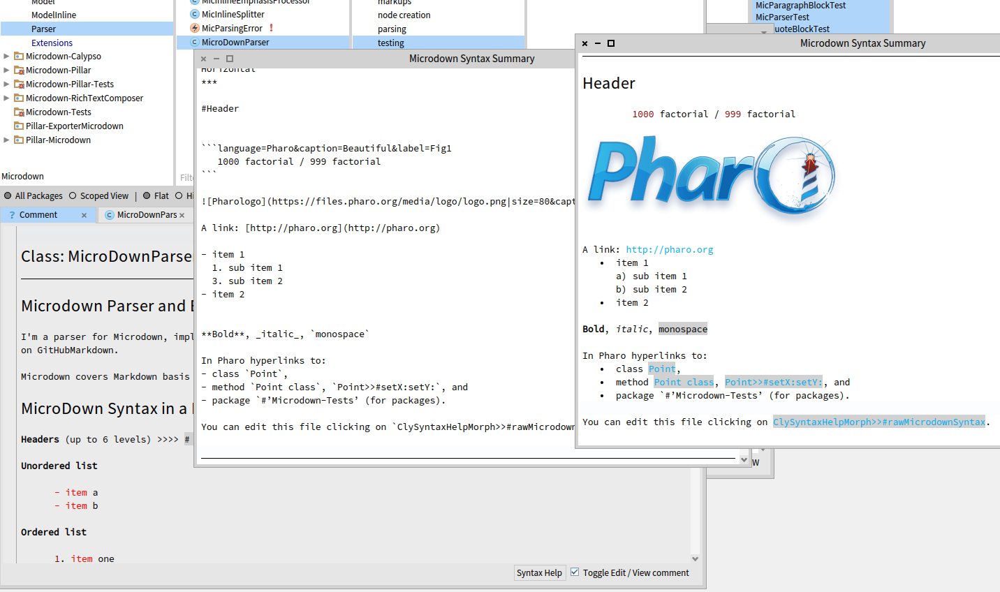

# Microdown Parser and Elements

I'm a parser for microdown implemented by S. Ducasse, L. Dargaud and G. Polito. The implementation is based on the work on markdown of K. Osterbye. Microdown is a smaller markdown but it is more extensible.   

## Quick start
### Loading specific version

To load the latest stable version load the master. If you have trouble loading in latest Pharo just execute the preloading.st script in the .github folder.
This script will remove exiting Microdown package and clear the system.

```Smalltalk
Metacello new
  baseline: 'Microdown';
  repository: 'github://pillar-markup/Microdown:master/src';
  load.
```

### Loading latest development version
We are about to release a version 2.0.0 of Microdown with enhanced model, visitor.... no dependency with Pillar anymore.
It is used for example by the BeautifulComments project.

```Smalltalk
Metacello new
	baseline: 'Microdown';
	repository: 'github://pillar-markup/Microdown:dev/src';
	onConflict: [ :ex | ex useIncoming ];
	onUpgrade: [ :ex | ex useIncoming ];
	load.
 ```

## Why should you use Microdown

Microdown is a smaller markdown but it is more extensible.

It supports
- Header
- Lists
- Paragraph
- Code with arguments: key=val&key2=val2
...

But also 
- Environment with arguments
- Table
- Anchor
- Annotated paragraph
- Math with arguments
- and more intra block elements such as extensible markups, raw, math, and references.





## Core Syntax in 2 seconds

```
   	#Header

	```language=Pharo&caption=Beautiful&label=Fig1
   	code
	```
   
   	> Boring quote block 
   	> Don't use me!

   	
	
   	- list
   	1. ordered list 

  	`in text` and for Pharo hyperlinks to class, method and package: 
  	`Point`, `Point class`, `Point>>#setX:setY:`, `#’Microdown-Tests’ (for packages)

  	References: *@ref*
```

## Full Syntax
Under writing...

### Headers
Similar to markdown headers are composed of `#` space text on one line.
The headers can be from 1 to 6

```
### Header Level3
```
There is not support for other forms of declaration. 

### Anchors
In microdown we can define anchors and reference to them (see References).
There are three ways to create anchors

- `@anchorlabel` will create an anchor to the preceeding element. 
- Figures, mathematical environments, environment can specify label as arguments (`label`)
- Code block can specify label as argument (argument named `label`)

### Codeblock

Microdown offer the same code block that markdown but arguments can be specified and the annotation should be named. The first line after the \`\`\` can be `language=pharo|label=code1|caption=this is my great piece of code`

The following code is not able to display it because markdown quote block are strange and interpret nested block. So we cannot use quoteblock for quoting!

``` 
   ```language=pharo|label=code1|caption=this is my great piece of code
    codeBlockMarkupString
    ^ '```'
    ```
```
````
```language=pharo|label=code1|caption=this is my great piece of code
codeBlockMarkupString
   ^ '\`\`\`'
```
````

More to come...

## Known limits

#### Quote block
When a line starts with '> ' it delimits a quoteblock.
However the markup is not interpreted. 

#### Codeblock 
Codeblock do not support more than for backticks.

## Implementation
I follow the design mentioned in [https://github.github.com/gfm](https://github.github.com/gfm), in particular the parsing strategy in appendix A.

In short, the strategy is that at any point in time, we might have a number of children of the root which are ""open"". The deepest in open in the tree is called ""current"". All the parents of current are open. 

When a new line is read we do the following:

1. Check if the new line can be consumed by current.
	- as part of this a child of current can be made which can consume the new line
2. If current cannot consume the new line, we close current, move current to its parent, and repeat 1.
3. The root node can consume anything, for instance by making new nodes for storing the new line.
4. The root node is not closed until input is exhausted

The other packages in this repository are the extensions made to produce Pillar model. 
Such packages should be moved in the future to other location (probably pillar itself).

Pillou followed by     
   should produce another paragraph?


